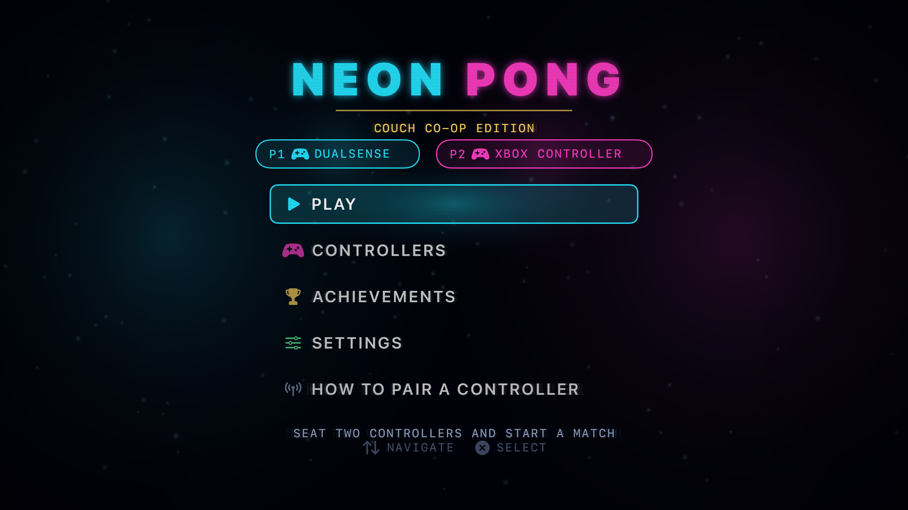
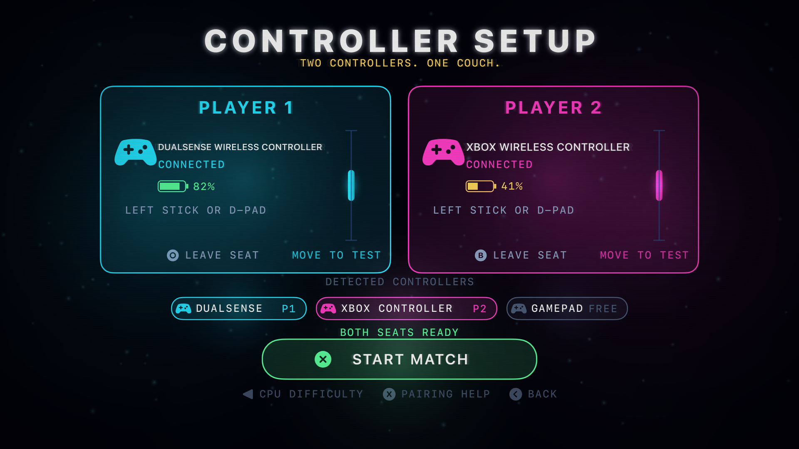
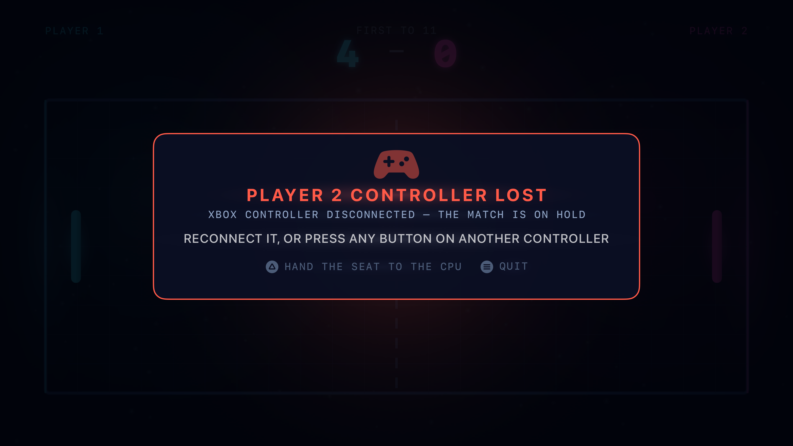
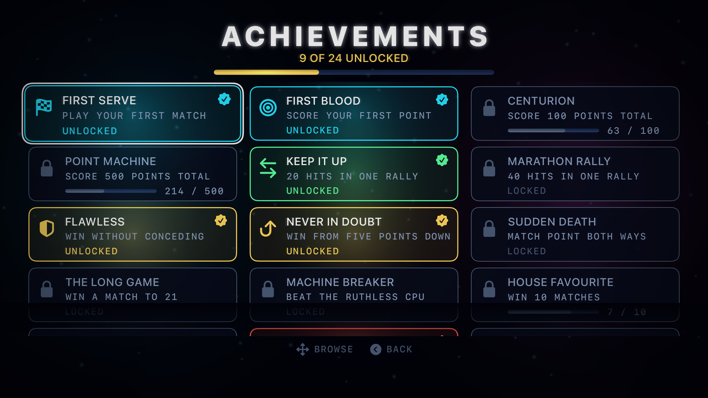
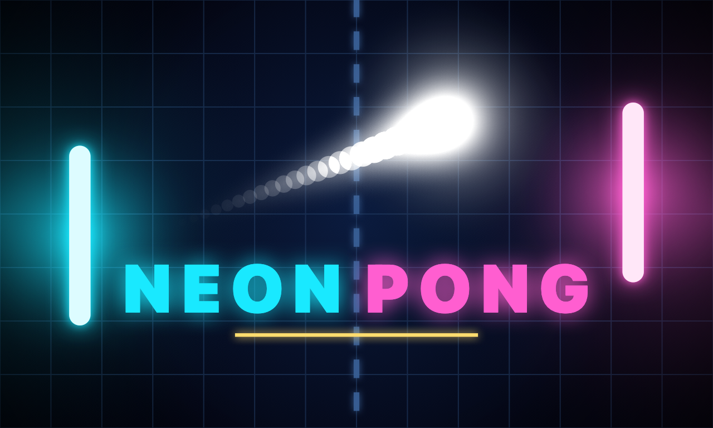

# Neon Pong — Couch Co-op Edition

An old-school Pong for Apple TV, built for two people on one sofa. Native
Swift + SpriteKit, tvOS 17+, no third-party dependencies, no bitmap art or audio
files — every texture and every sound is generated in code at launch.



---

## Install it on your Apple TV

Signing is automatic; the only thing the repo does not carry is your team ID.

1. **Tell it your team.** Copy `Configs/Signing.xcconfig.example` to
   `Configs/Signing.xcconfig` (gitignored) and put your team ID in it. It is
   the ten-character code in brackets next to your team under
   Xcode ▸ Settings ▸ Accounts. If Xcode has no account yet, add your Apple ID
   there first; without one a device build stops with
   `error: No Accounts: Add a new account in Accounts settings`.
2. **Pair the Apple TV.** On the Apple TV: Settings ▸ Remotes and Devices ▸
   Remote App and Devices. Then in Xcode: Window ▸ Devices and Simulators ▸
   your Apple TV ▸ enter the six-digit code. Mac and Apple TV must be on the
   same network.
3. **Run.** Open `NeonPong.xcodeproj`, pick your Apple TV as the destination,
   press ⌘R. Xcode registers the device and mints the tvOS development profile
   on the fly. From the command line:

   ```bash
   ATV=$(xcrun devicectl list devices | awk '/Apple TV/ {print $(NF-3)}' | head -1)
   xcodebuild -project NeonPong.xcodeproj -scheme NeonPong -configuration Debug \
     -destination "platform=tvOS,id=$ATV" -derivedDataPath build/DDdev \
     -allowProvisioningUpdates -allowProvisioningDeviceRegistration build
   xcrun devicectl device install app --device "$ATV" \
     build/DDdev/Build/Products/Debug-appletvos/NeonPong.app
   xcrun devicectl device process launch --device "$ATV" com.lorenzonuvoletta.neonpong
   ```

   `-allowProvisioningDeviceRegistration` is the flag people miss: pairing an
   Apple TV does not register it on your developer account, and without it you
   get `Device "…" isn't registered in your developer account`.

   Deployment target is tvOS 17, so anything from Apple TV HD (2015) onward
   will take it.

There is no "trust this developer" step on tvOS — that pane is iOS-only. A
development-signed tvOS app launches straight from Xcode.

> On a paid Apple Developer Program membership the build stays valid on the
> device for a year. On a free personal team it lasts 7 days and has to be
> re-run from Xcode.

## Build and run in the simulator

```bash
brew install xcodegen                 # only needed once
xcodegen generate                     # regenerates NeonPong.xcodeproj
./Tools/rebuild.sh                    # builds + installs on the booted tvOS sim
```

`Tools/rebuild.sh` expects a booted Apple TV simulator whose UDID is in
`/tmp/np_device`. To set one up:

```bash
xcodebuild -downloadPlatform tvOS     # if the tvOS runtime is missing
xcrun simctl list devices available | grep "Apple TV 4K (3rd generation)"
echo <UDID> > /tmp/np_device && xcrun simctl boot <UDID>
```

`./check.sh` type-checks every source file against the tvOS SDK in a few
seconds, which is much faster than a full build while iterating.

---

## Playing

### Controllers

Any Bluetooth game controller tvOS supports works: DualSense, DualShock 4, Xbox
Wireless, Switch Pro, MFi pads, and the Siri Remote. The setup screen is built
around **press-to-join**:



- Any unseated controller presses its confirm button to take the first free seat.
- The seat lights up in that player's colour, the pad **rumbles**, its **player
  LEDs** are set, and on a DualSense/DualShock the **light bar** turns cyan or
  magenta.
- Each seat shows the pad's real product name, its **battery level**, and a
  **live paddle preview** — move the stick and the little paddle in the bay
  moves, so you can confirm you are holding the right controller.
- Button prompts are drawn in that pad's own dialect: a PlayStation pad is told
  to press Cross, an Xbox pad is told to press A.
- Press back to leave a seat. Press the Y-equivalent to seat a **CPU** instead,
  then left/right to pick Casual, Pro or Ruthless.
- Seat assignments are remembered between launches, so the same pad drops back
  into the same seat next time.
- Pairing itself can't happen inside a tvOS app, so **How to pair a controller**
  spells out the exact system path and reports live as new controllers appear.

If a controller dies mid-match, play stops immediately and holds:



Reconnect it and the match resumes where it left off, or press confirm on any
other controller to drop into the empty seat, or hand it to the CPU.

### Controls

| | |
|---|---|
| Move paddle | Left stick, right stick, or D-pad |
| Siri Remote | Slide your thumb on the touch surface — it maps 1:1 onto the arena |
| Pause | Options on PlayStation, Menu on Xbox, or the Share/View button |
| Back | Circle / B, or the Options / Menu button |
| Menu navigation | Any connected controller can drive menus |

Button prompts name the physical button on the pad you are holding, which is not
always the letter you might expect: `GCExtendedGamepad` is position-based, so
`buttonX` is the *west* face button — Square on PlayStation, Y on a Switch Pro.

### Power-ups

A capsule spawns mid-arena every few seconds. Whoever last returned the ball
that hits it claims the effect.

| | | |
|---|---|---|
| **Expand** | your paddle grows | 11s |
| **Shrink Ray** | their paddle shrinks | 9s |
| **Multiball** | two extra balls | instant |
| **Fireball** | faster ball, worth 2 points | instant |
| **Shield** | blocks one shot on your goal line | one use |
| **Deep Freeze** | their paddle slows down | 6.5s |
| **Magnet** | the ball bends your way on your half | 8s |
| **Ghost Ball** | the ball fades out on their half | 8s |

### Achievements

24 of them, with progress bars and unlock toasts, tracked across every match
ever played on the device.



### Settings

Points to win (5 / 7 / 11 / 21), ball speed (Chill / Classic / Turbo),
power-ups, rumble, sound, screen shake and the CRT scanline overlay.

---

## How it is put together

```
Sources/
  App/        AppDelegate, GameViewController (Menu-button routing), Router, DebugHarness
  Core/       Theme, TextureFactory, Nodes (NeonLabel/PanelNode/SymbolNode),
              MenuList, Toast, SoundEngine, SaveStore, Math, Wordmark
  Input/      ControllerHub (discovery, seats, polling, rumble/LEDs), ControllerProfile
  Game/       Arena, Ball, Paddle, PowerUp(+Node), CPUOpponent, Effects, Achievements, MatchConfig
  Scenes/     Boot, Lobby (+SeatBay), Menu, Match, Result, Achievements, Settings, PairingHelp
Resources/    Info.plist, Assets.xcassets (generated)
Configs/      Base.xcconfig + your gitignored Signing.xcconfig (team ID)
Tools/        IconForge.swift, build_assets.py, capture.sh, rebuild.sh
.agents/      skills distilled from building this; .claude and .codex symlink here
```

A few decisions worth knowing about:

- **Manual physics, not `SKPhysicsBody`.** The ball is integrated by hand with
  sub-stepping sized so it never moves more than 0.7 × its radius per step. A
  2000-unit/second ball would otherwise tunnel straight through a paddle. The
  bounce angle comes from where on the bat you hit it, which is the rule the
  original is built on.
- **Everything is generated.** `TextureFactory` renders glows, capsules, rings,
  scanlines and panels with Core Graphics; `SoundEngine` synthesises every bleep
  and explosion with `AVAudioEngine` at launch. There are no `.png` or `.wav`
  assets in `Sources/`.
- **Text glow.** Display type uses a real `CIGaussianBlur`; body copy stacks
  slightly enlarged additive copies. Forty simultaneous blur passes is more than
  SpriteKit will reliably render, and the ones that get dropped show up as
  labels that randomly lose their bloom. The stacked copies also carry an
  explicit `zPosition`, because the view runs with `ignoresSiblingOrder` and the
  crisp glyphs would otherwise sometimes be drawn over their own glow.
- **The Menu button** is handled through `UIPress` in `GameViewController`, not
  through `GameController` handlers. Consuming it keeps you in the app; letting
  it through at the main menu is what makes "press Menu at the top level to
  leave" behave the way tvOS expects.

## Regenerating the art

The app icon (a layered tvOS parallax stack), the App Store icon, both top shelf
images and the launch image are all rendered from code:

```bash
xcrun swift Tools/IconForge.swift artifacts/art
python3 Tools/build_assets.py
```



## Screenshots and video

`Tools/capture.sh` launches the app on the booted simulator with `NP_*`
overrides and grabs a screenshot. The overrides are debug-build only and inert
unless set.

```bash
./Tools/capture.sh lobby 3 NP_SCENE=lobby NP_CONTROLLERS=dualsense,xbox NP_SEAT=2
./Tools/capture.sh match 4 NP_SCENE=match NP_CPU=both NP_SCORES=7,6 NP_EFFECTS=grow,freeze
```

| Variable | Effect |
|---|---|
| `NP_SCENE` | `boot`, `lobby`, `menu`, `match`, `result`, `achievements`, `settings`, `pairing` |
| `NP_CONTROLLERS` | comma list of `dualsense`, `xbox`, `siri` — creates hardware-free pads |
| `NP_SEAT` | how many of them to seat |
| `NP_CPU` | `1` seats a CPU as P2, `both` for a CPU-vs-CPU demo |
| `NP_SCORES` | e.g. `7,4` |
| `NP_EFFECTS` | e.g. `grow,freeze` |
| `NP_POWERUP` | drop one pickup immediately, e.g. `fireball` |
| `NP_PAUSED` / `NP_DISCONNECT` / `NP_NOCOUNTDOWN` | open in that state |
| `NP_ACHIEVEMENTS=seed` | unlock a representative spread |
| `NP_SCRIPT=join` | drives the real press-to-join → start flow, for recordings |

Captured evidence lives in `artifacts/shots/` and `artifacts/video/`.

## Known notes

- The launch image produces two build warnings: tvOS deprecated `UILaunchImages`
  in tvOS 13 in favour of a launch storyboard. It still works, and `ibtool`
  cannot compile storyboards in a headless session, so the image stays. If you
  want to switch, add a `LaunchScreen.storyboard` from inside Xcode and set
  `UILaunchStoryboardName`.
- `DebugHarness.swift` and the `NP_*` overrides are wrapped in `#if DEBUG` and
  are not compiled into a Release build.
